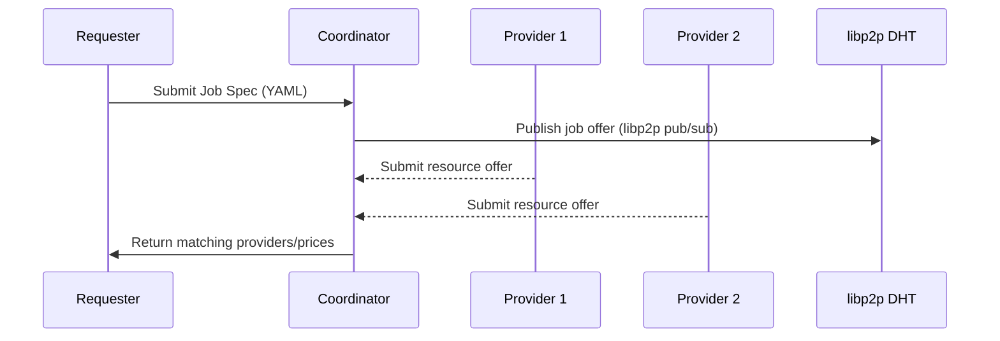
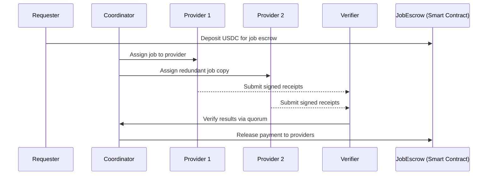
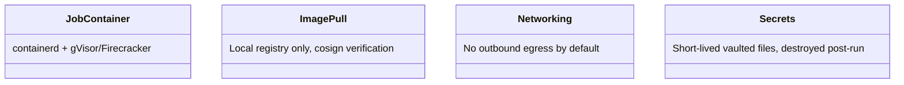

# OpenGrid Architecture

## Network Flow Diagrams

### Discovery and Bidding

```mermaid
sequenceDiagram
participant R as Requester
participant C as Coordinator
participant P1 as Provider 1
participant P2 as Provider 2
participant DHT as libp2p DHT

R->>C: Submit Job Spec (YAML)
C->>DHT: Publish job offer (libp2p pub/sub)
P1-->>C: Submit resource offer
P2-->>C: Submit resource offer
C->>R: Return matching providers/prices
```

### Verification and Payment

```mermaid
sequenceDiagram
participant R as Requester
participant C as Coordinator
participant P1 as Provider 1
participant P2 as Provider 2
participant V as Verifier
participant E as JobEscrow (Smart Contract)

R->>E: Deposit USDC for job escrow
C->>P1: Assign job to provider
C->>P2: Assign redundant job copy
P1-->>V: Submit signed receipts
P2-->>V: Submit signed receipts
V->>C: Verify results via quorum
C->>E: Release payment to providers
```

### Security Hardening

```mermaid
classDiagram
JobContainer : containerd + gVisor/Firecracker
ImagePull : Local registry only, cosign verification
Networking : No outbound egress by default
Secrets : Short-lived vaulted files, destroyed post-run
```

